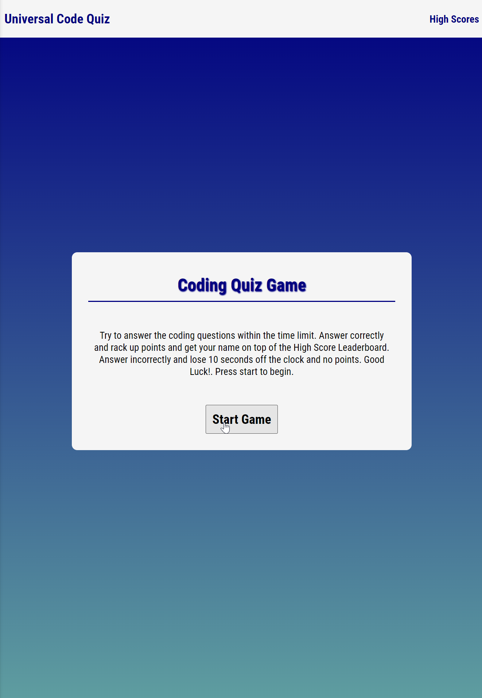
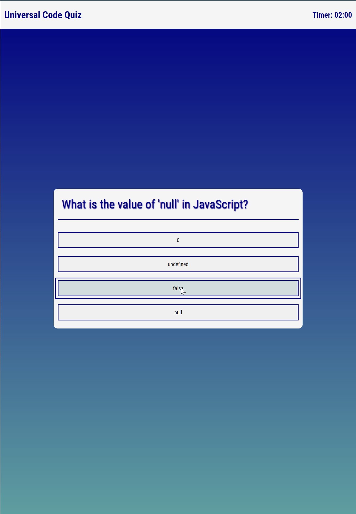
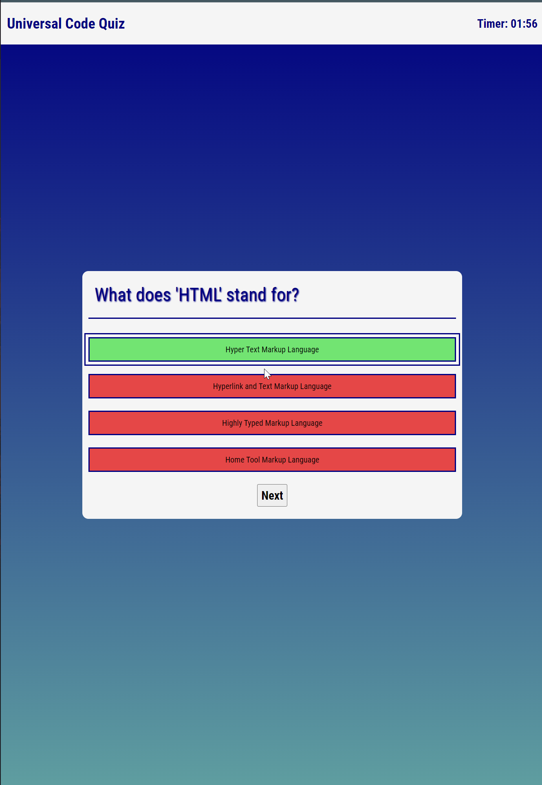
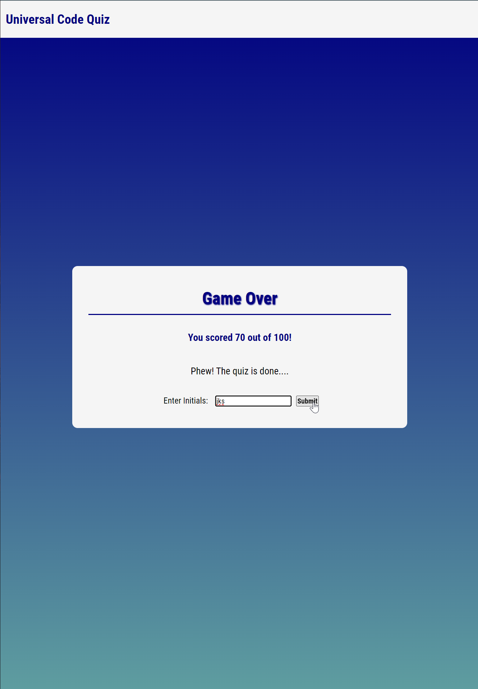
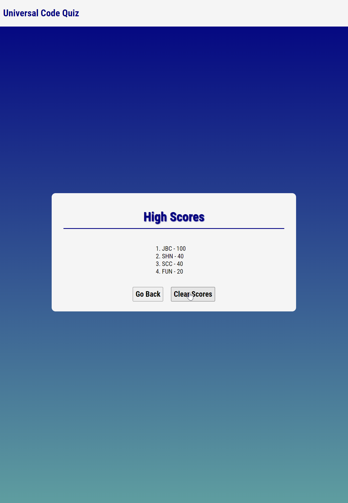

# Universal Code Quiz

## Description
Code quiz that is configurable with new questions. This is an easy to use code quiz site that can be used to study for any type of coding quiz. The is a one page site that dynamically moves in an out different screens for the user. Pre-loaded with sample questions for review for potential jobs.   

I was motivated to pursue this project to learn to the DOM and make use of JavaScript to master element traversal and manipulation. I built this project to add to my professional portfolio of projects and enhance my skill set. It allows the administrator to simply copy and paste new questions in for different quizzes. I learned a lot on this project including DOM navigation, Javascript eventListener functionality, advanced CSS, how to show and hide items effectively.  

## Usage

This refactored site is up at github pages:

INSERT LINK 

Location in Github Repository:

LINK

Game Play:

    1. Start Quiz.
    2. 2:00 min timer set and first question presented.
    3. Click on the question that you think is correct.
    4. Once a selection is chosen option will turn green if correct or red if wrong.
    5. At end of questions if you scored above 0 pts you can enter your initials for the high score page.
    6. If user chooses an incorrect answer 10 seconds is taken off the clock.
    7. If user finishes quiz or time runs out the game over screen is presented. 

Start page is easy to navigate. The whole site is contained in the card section in the center of the page. With the exception of the "High Scores" link in the top right corner of page: 

Question 1 appears and the timer starts in the top right part of the page at 2:00 min.

After user selects an answer the answers choices turn green for correct or red for wrong. A next button appears at the bottom to progress to the next question. 

At the end of the quiz if you scored above 0 points then you can enter your initials for the high score page. 

The high scores page can only be accessed from the top of the start page. If you click the link you will be shown the high scores stored in local storage. User has option to clear scores. 

## Credits

Coding Boot Camp. (n.d.). Professional Readme Guide. GitHub. https://coding-boot-camp.github.io/full-stack/github/professional-readme-guide

Web Dev Simplified. (2019, June 15th). Build a Quiz App With Javascript. YouTube. https://www.youtube.com/watch?v=riDzcEQbX6k 

Mozilla. (n.d.). Element.classList. MDN Web Docs. https://developer.mozilla.org/en-US/docs/Web/API/Element/classList

OpenAI. (2023, October 8). Create 10 random beginner level JavaScript quiz questions in the following format. ChatGPT by OpenAI. [Webpage]. https://www.chatgpt.com/blog/beginner-javascript-quiz-questions

dcode. (2018, June 19th). Dataset (dataset) Property - Javascript DOLM. YouTube. https://www.youtube.com/watch?v=Pt8RyyUWCtM

Mozilla. (n.d.). text-shadow. MDN Web Docs. https://developer.mozilla.org/en-US/docs/Web/CSS/text-shadow

Web.dev. (n.d.). CSS Border Animations. Web.dev. https://web.dev/css-border-animations/

Original Poster. (2010, September 16). Remove event listener in JavaScript after the event occurred. Stack Overflow. https://stackoverflow.com/questions/3723914/remove-eventlistener-in-javascript-after-event-occurred

Flavio Copes. (2016, December 6th). How to Sort an Array of Objects by Property in JavaScript. Flavio Copes. https://flaviocopes.com/how-to-sort-array-of-objects-by-property-javascript/

## Features

There are several obvious and not so obvious features of this site:

LIST FEATURES
